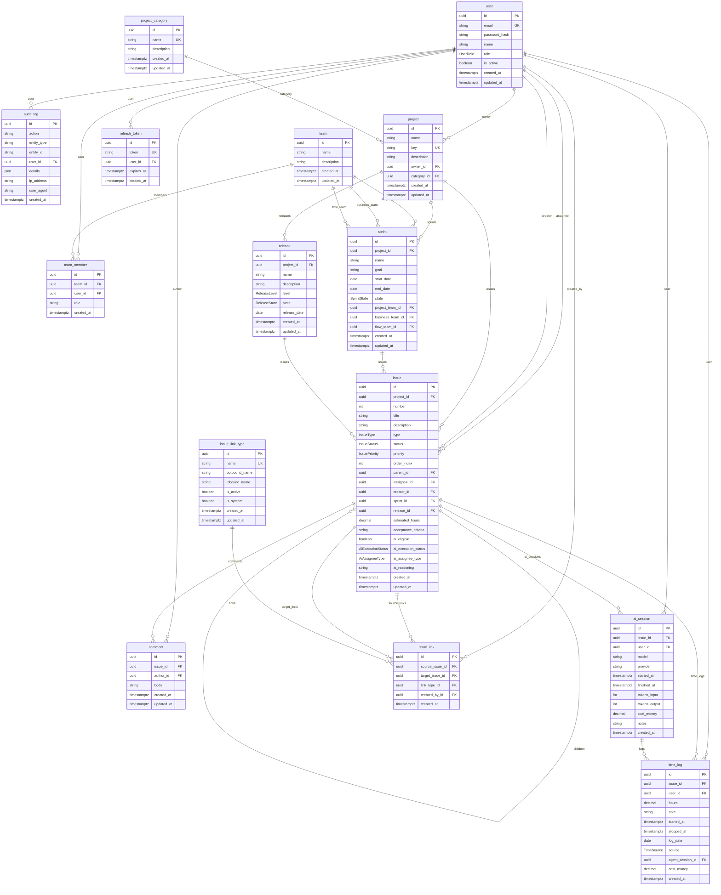

# Flow Universe MVP — Domain Model

**Purpose:** Current domain model of the implemented MVP. Reflects the DB schema (`schema.prisma`) as of March 2026.
**Last updated:** March 2026

---

## 1. Entities

| Entity | Description |
|--------|-------------|
| **User** | Account; authentication, global role, active flag. |
| **RefreshToken** | JWT refresh token for rotation; linked to User. |
| **ProjectCategory** | Project category (reference table); optional grouping. |
| **Project** | Work container; unique key (e.g. `TTMP`), owner, category. |
| **Issue** | Unit of work; type (EPIC/STORY/TASK/SUBTASK/BUG), hierarchy, AI attributes. |
| **Sprint** | Project iteration; linked to three team types (project/business/flow). |
| **Release** | Project release; groups issues by version. |
| **Comment** | Comment on an issue; author is a User. |
| **TimeLog** | Time entry; source is either a human or an AI agent. |
| **AiSession** | AI agent work session; stores tokens, cost, model. |
| **AuditLog** | Mutation record for any entity (CRUD); compliance, RBAC. |
| **IssueLinkType** | Type of link between issues (blocks, duplicates, relates to…). |
| **IssueLink** | Concrete directed link between two issues with a given type. |
| **Team** | Team; can serve as project/business/flow team in a sprint. |
| **TeamMember** | User membership in a team with an optional per-team role. |

---

## 2. Relationships

- **User** → creator/assignee on **Issue**; author of **Comment**; owner of **TimeLog**; participant in **AiSession** and **AuditLog**.
- **Project** → many **Issue**, **Sprint**, **Release**; one **ProjectCategory**; one **User** (owner).
- **Issue** → belongs to **Project**; has parent/children (**Issue**); linked to **Sprint**, **Release**; many **Comment**, **TimeLog**, **AiSession**, **IssueLink**.
- **Sprint** → belongs to **Project**; optionally linked to three **Team** (projectTeam, businessTeam, flowTeam).
- **Release** → belongs to **Project**; many **Issue**.
- **TimeLog** → belongs to **Issue**; optionally linked to **User** and **AiSession**.
- **AiSession** → linked to **Issue** and **User**; many **TimeLog**.
- **IssueLink** → connects sourceIssue and targetIssue through **IssueLinkType**; created by **User**.
- **TeamMember** → connects **Team** and **User**.

---

## 3. Enumerations

| Enum | Values |
|------|--------|
| `UserRole` | `SUPER_ADMIN`, `ADMIN`, `MANAGER`, `USER`, `VIEWER` |
| `IssueType` | `EPIC`, `STORY`, `TASK`, `SUBTASK`, `BUG` |
| `IssueStatus` | `OPEN`, `IN_PROGRESS`, `REVIEW`, `DONE`, `CANCELLED` |
| `IssuePriority` | `CRITICAL`, `HIGH`, `MEDIUM`, `LOW` |
| `AiExecutionStatus` | `NOT_STARTED`, `IN_PROGRESS`, `DONE`, `FAILED` |
| `AiAssigneeType` | `HUMAN`, `AGENT`, `MIXED` |
| `SprintState` | `PLANNED`, `ACTIVE`, `CLOSED` |
| `ReleaseLevel` | `MINOR`, `MAJOR` |
| `ReleaseState` | `DRAFT`, `READY`, `RELEASED` |
| `TimeSource` | `HUMAN`, `AGENT` |

---

## 4. Issue — Field Reference

| Field | Type | Description |
|-------|------|-------------|
| `id` | UUID PK | Primary key. |
| `project_id` | FK → Project | Owner project. |
| `number` | Int | Sequential number within project (forms `TTMP-42` with the key). |
| `title` | String | Short title. |
| `description` | String? | Full description. |
| `type` | IssueType | EPIC / STORY / TASK / SUBTASK / BUG. |
| `status` | IssueStatus | OPEN / IN_PROGRESS / REVIEW / DONE / CANCELLED. |
| `priority` | IssuePriority | CRITICAL / HIGH / MEDIUM / LOW. |
| `order_index` | Int | Position in backlog / on board. |
| `parent_id` | FK → Issue? | Parent issue (hierarchy). |
| `assignee_id` | FK → User? | Assignee. |
| `creator_id` | FK → User | Creator. |
| `sprint_id` | FK → Sprint? | Sprint (if issue is in a sprint). |
| `release_id` | FK → Release? | Release (if issue is scoped to a release). |
| `estimated_hours` | Decimal? | Effort estimate in hours. |
| `acceptance_criteria` | String? | Acceptance criteria. |
| `ai_eligible` | Boolean | Issue is available for the AI agent. |
| `ai_execution_status` | AiExecutionStatus | AI agent execution state. |
| `ai_assignee_type` | AiAssigneeType | HUMAN / AGENT / MIXED. |
| `ai_reasoning` | String? | AI explanation (estimate, assignee suggestion). |
| `created_at` | DateTime | Creation timestamp. |
| `updated_at` | DateTime | Last update timestamp. |

**Issue hierarchy:**

```
EPIC
  └── STORY / TASK
        └── SUBTASK
BUG  (can be a child of EPIC, STORY, or TASK)
```

---

## 5. TimeLog — Field Reference

| Field | Type | Description |
|-------|------|-------------|
| `id` | UUID PK | Primary key. |
| `issue_id` | FK → Issue | Issue. |
| `user_id` | FK → User? | User (null for agent logs with no user binding). |
| `hours` | Decimal(6,2) | Time spent in hours. |
| `note` | String? | Free-form note. |
| `started_at` | DateTime? | Timer start. |
| `stopped_at` | DateTime? | Timer stop. |
| `log_date` | Date | Log date (defaults to today). |
| `source` | TimeSource | HUMAN or AGENT. |
| `agent_session_id` | FK → AiSession? | AI session (when source=AGENT). |
| `cost_money` | Decimal(10,4)? | Monetary cost (for agent logs). |
| `created_at` | DateTime | Record creation timestamp. |

---

## 6. AiSession — Field Reference

| Field | Type | Description |
|-------|------|-------------|
| `id` | UUID PK | Primary key. |
| `issue_id` | FK → Issue? | Issue the agent worked on. |
| `user_id` | FK → User? | Initiating user. |
| `model` | String | Model identifier (e.g. `claude-sonnet-4-6`). |
| `provider` | String | Provider (Anthropic). |
| `started_at` | DateTime | Session start. |
| `finished_at` | DateTime | Session end. |
| `tokens_input` | Int | Input tokens. |
| `tokens_output` | Int | Output tokens. |
| `cost_money` | Decimal(10,4) | Monetary cost of the session. |
| `notes` | String? | Optional notes. |
| `created_at` | DateTime | Record creation timestamp. |

---

## 7. Entity Diagram



---

## 8. Backend Modules

| Module | Entities / Responsibility |
|--------|--------------------------|
| `auth` | User, RefreshToken — register, login, refresh, logout, me |
| `users` | User — CRUD, role management |
| `projects` | Project — CRUD with unique keys |
| `project-categories` | ProjectCategory — category reference data |
| `issues` | Issue — CRUD, hierarchy, filtering, search |
| `sprints` | Sprint — create, start, close, move issues |
| `releases` | Release — group issues by version |
| `boards` | Kanban logic, drag-and-drop, issue ordering |
| `comments` | Comment — CRUD |
| `time` | TimeLog — timer start/stop, manual entry |
| `teams` | Team, TeamMember — team management |
| `links` | IssueLink, IssueLinkType — issue relationships |
| `ai` | AiSession — effort estimation, suggest-assignee, AI Dev Loop |
| `audit` | AuditLog — records all mutations |
| `admin` | System administration |
| `monitoring` | Self-monitoring dashboard |
| `integrations` | GitLab webhook, external integrations |
| `webhooks` | Incoming webhook event handling |

---

## 9. Features Delivered vs. Original Plan

The following items were listed as "future scope" in the original document (March 2025) and are **now implemented:**

| Area | Status |
|------|--------|
| Issue hierarchy (EPIC→STORY→TASK→SUBTASK, BUG) | ✅ Done |
| Teams and membership (Team, TeamMember) | ✅ Done |
| Kanban board (boards module) | ✅ Done |
| Sprints (Sprint, SprintState) | ✅ Done |
| Issue links (IssueLink, IssueLinkType) | ✅ Done |
| AI module (AiSession, ai_eligible, estimation, assignee) | ✅ Done |
| Audit log (AuditLog, compliance) | ✅ Done |
| Releases (Release, ReleaseLevel, ReleaseState) | ✅ Done |
| Project categories (ProjectCategory) | ✅ Done |

**Still planned (roadmap):**

| Area | Description |
|------|-------------|
| Organizations | Multi-tenancy; org_id on all entities. |
| Labels | Issue tags, many-to-many with Issue. |
| Custom fields | Configurable issue fields per project. |
| KeyCloak / ALD Pro SSO | Enterprise SSO authentication. |
| Confluence integration | Link knowledge base articles to issues. |
| Telegram bot | Notifications via Telegram. |

---

## 10. Summary

- **15 entities** in the implemented domain model.
- **Issue** has 5 types, 5 statuses, 4 priorities, parent-child hierarchy, and AI attributes.
- **AI Dev Loop** (Sprint 5): issues can be executed by an AI agent with full session and cost tracking.
- **AuditLog** provides full mutation traceability for compliance.
- **Sprint** is linked to three team types (project/business/flow) to support varied org structures.
- **TimeLog** is split by source (HUMAN/AGENT) for separate cost accounting.
