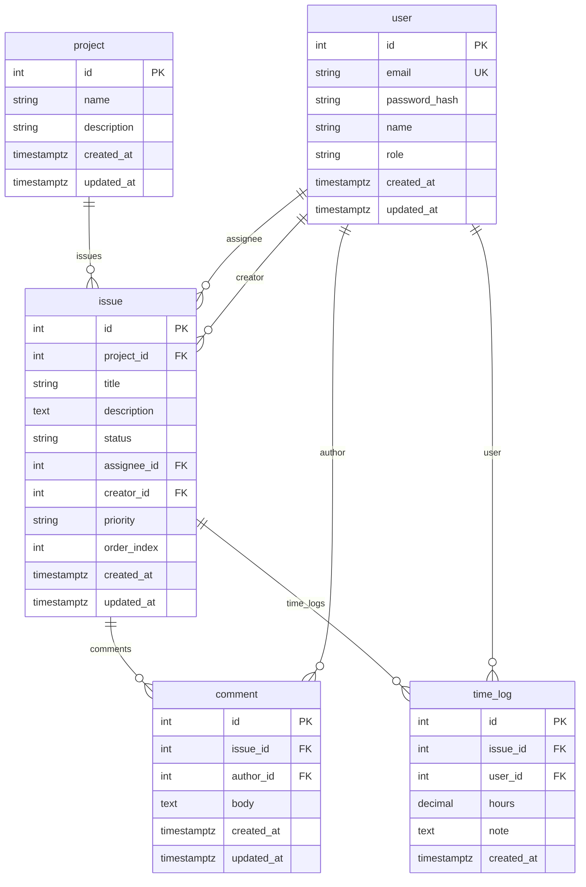

# Flow Universe MVP — Simplified Domain Model

**Purpose:** Minimal domain model for the MVP. Reduces complexity to speed up delivery; advanced features are documented as future scope.  
**Date:** March 2025

---

## 1. MVP Core Entities

| Entity | Short description |
|--------|--------------------|
| **User** | Identity, authentication, global role. |
| **Project** | Work container; has issues and time logs. |
| **Issue** | Single unit of work; belongs to project; has title, description, status, assignee, creator, priority, order. |
| **Comment** | Thread on an issue; author = user, body text, created_at / updated_at. |
| **Time_log** | Time entry linked to an issue; user, amount, optional note; created_at. |

---

## 2. MVP Relationships

- **User** → assignee or creator on **Issues**; author of **Comments**; owner of **Time_logs**.
- **Project** → has many **Issues**; has many **Time_logs** (via issues).
- **Issue** → belongs to **Project**; has **Assignee**, **Creator** (users); has many **Comments**; has many **Time_logs**.
- **Comment** → belongs to **Issue**; has **Author** (User).
- **Time_log** → belongs to **Issue**; has **User** (who logged the time).

---

## 3. Issue (MVP)

**Fields:**

| Field | Description |
|-------|-------------|
| id | Primary key. |
| project_id | Reference to project. |
| title | Short title. |
| description | Full description (text). |
| status | One of: `open`, `in_progress`, `review`, `done`. |
| assignee_id | User who is assigned (optional). |
| creator_id | User who created the issue. |
| priority | Priority (e.g. low, medium, high). |
| order_index | Order within project (e.g. for backlog/board). |
| created_at | Creation timestamp. |
| updated_at | Last update timestamp. |

**Status values (fixed for MVP):**

- `open` — not started  
- `in_progress` — in work  
- `review` — in review  
- `done` — completed  

No separate Status entity; status is a string on the issue. A simple Kanban view can map these four statuses to columns.

---

## 4. Entity Diagram (MVP)

---

## 5. What Replaces What (Current → MVP)

| Current | MVP |
|---------|-----|
| users | **User** |
| projects | **Project** |
| tasks + task_items | **Issue** (single table) |
| time_logs | **Time_log** (link to issue_id) |
| — | **Comment** (new) |

---

## 6. Future Features (Out of MVP Scope)

The following are **intentionally postponed** to keep the MVP simple and deliver faster. They remain part of the long-term architecture vision.

| Area | Description |
|------|-------------|
| **Organizations** | Multi-tenant top-level entity; users and projects scoped by organization. |
| **Labels** | Tags scoped to project (or org); many-to-many with issues. |
| **Advanced boards** | Multiple boards per project, configurable columns, WIP limits, board-column entity. |
| **Issue hierarchy** | Parent-child (epic → story → subtask); issue type and parent_id. |
| **Team ownership** | Teams as entities; team membership; project/issue ownership by team. |

When these are introduced, the domain model will be extended (e.g. add org_id, label tables, board/board_column, parent_id and type on issue, team/team_member). The MVP model is designed so that such extensions do not conflict with the current structure.

---

## 7. Summary

- **Five core entities** in MVP: User, Project, Issue, Comment, Time_log.
- **Issue** has a fixed set of fields and four statuses: open, in_progress, review, done.
- **No organizations, teams, boards, labels, or issue hierarchy** in MVP — they are documented as future features.
- This simplification reduces implementation and testing effort and shortens time to first usable release.

This model is the basis for the current architecture, API, and migration plan.
