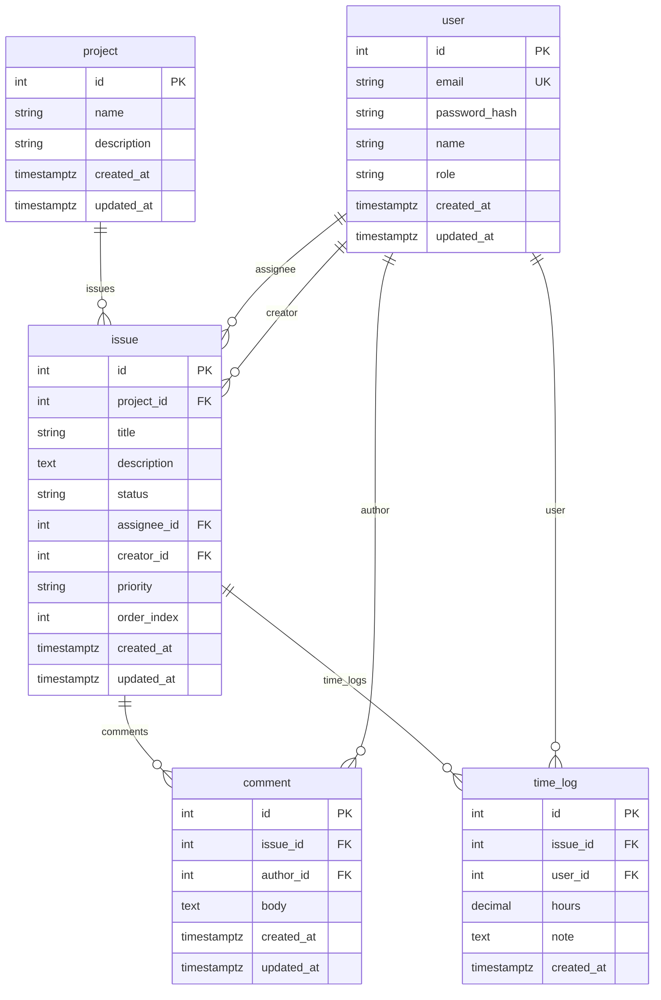

# TaskTime MVP — Упрощённая доменная модель

**Назначение:** Минимальная доменная модель для MVP. Снижение сложности для ускорения поставки; расширенные возможности вынесены в будущий контур.  
**Дата:** март 2025

---

## 1. Основные сущности MVP

| Сущность | Краткое описание |
|----------|------------------|
| **User** | Учётная запись, аутентификация, глобальная роль. |
| **Project** | Контейнер работ; содержит задачи и учёт времени. |
| **Issue** | Одна единица работы; принадлежит проекту; заголовок, описание, статус, исполнитель, автор, приоритет, порядок. |
| **Comment** | Обсуждение по задаче; автор — пользователь, текст, created_at / updated_at. |
| **Time_log** | Запись времени по задаче; пользователь, объём, опционально заметка; created_at. |

---

## 2. Связи в MVP

- **User** → исполнитель или автор по **Issues**; автор **Comments**; владелец записей **Time_logs**.
- **Project** → много **Issues**; учёт времени идёт через задачи (**Time_logs** по **Issues**).
- **Issue** → принадлежит **Project**; **Assignee**, **Creator** (пользователи); много **Comments**; много **Time_logs**.
- **Comment** → принадлежит **Issue**; **Author** (User).
- **Time_log** → принадлежит **Issue**; **User** (кто списал время).

---

## 3. Issue (MVP)

**Поля:**

| Поле | Описание |
|------|----------|
| id | Первичный ключ. |
| project_id | Ссылка на проект. |
| title | Краткий заголовок. |
| description | Полное описание (текст). |
| status | Один из: `open`, `in_progress`, `review`, `done`. |
| assignee_id | Назначенный пользователь (опционально). |
| creator_id | Пользователь, создавший задачу. |
| priority | Приоритет (например low, medium, high). |
| order_index | Порядок в рамках проекта (бэклог/доска). |
| created_at | Время создания. |
| updated_at | Время последнего обновления. |

**Статусы (фиксированный набор для MVP):**

- `open` — не начата  
- `in_progress` — в работе  
- `review` — на проверке  
- `done` — выполнена  

Отдельной сущности Status нет; статус хранится строкой в задаче. Простой Kanban может отображать эти четыре статуса как колонки.

---

## 4. Диаграмма сущностей (MVP)

---

## 5. Соответствие текущего и MVP

| Сейчас | MVP |
|--------|-----|
| users | **User** |
| projects | **Project** |
| tasks + task_items | **Issue** (одна таблица) |
| time_logs | **Time_log** (связь по issue_id) |
| — | **Comment** (новое) |

---

## 6. Будущие возможности (вне контура MVP)

Следующее **намеренно вынесено** за рамки MVP, чтобы сохранить простоту и быстрее выйти на первый рабочий релиз. Эти идеи остаются в видении архитектуры на перспективу.

| Область | Описание |
|---------|----------|
| **Организации** | Мультитенантность: сущность верхнего уровня; пользователи и проекты в рамках организации. |
| **Метки (Labels)** | Теги в рамках проекта (или организации); связь многие-ко-многим с задачами. |
| **Расширенные доски** | Несколько досок на проект, настраиваемые колонки, WIP-лимиты, сущность колонки доски. |
| **Иерархия задач** | Родитель–потомок (epic → story → subtask); тип задачи и parent_id. |
| **Владение командами** | Команды как сущности; членство в команде; владение проектом/задачей командой. |

При добавлении этих возможностей доменная модель будет расширена (например org_id, таблицы меток, доска/колонка, parent_id и type у задачи, команда/участник). Текущая MVP-модель спроектирована так, чтобы такие расширения не конфликтовали с ней.

---

## 7. Итог

- **Пять основных сущностей** в MVP: User, Project, Issue, Comment, Time_log.
- **Issue** имеет фиксированный набор полей и четыре статуса: open, in_progress, review, done.
- **Организации, команды, доски, метки и иерархия задач** в MVP не входят — они описаны как будущие возможности.
- Упрощение снижает объём реализации и тестирования и сокращает срок до первого пригодного к использованию релиза.

Эта модель — основа текущей архитектуры, API и плана миграции.
