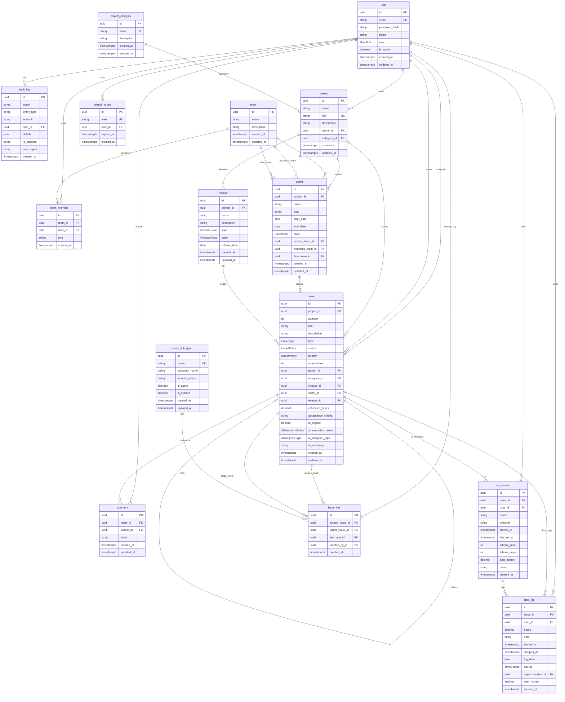

# Flow Universe MVP — Доменная модель

**Назначение:** Актуальная доменная модель реализованного MVP. Отражает схему БД (`schema.prisma`) по состоянию на март 2026.
**Дата последнего обновления:** март 2026

---

## 1. Сущности системы

| Сущность | Описание |
|----------|----------|
| **User** | Учётная запись; аутентификация, глобальная роль, флаг активности. |
| **RefreshToken** | Refresh-токен для ротации JWT; привязан к User. |
| **ProjectCategory** | Категория проектов (справочник); опциональная группировка проектов. |
| **Project** | Контейнер работ; имеет уникальный ключ (напр. `TTMP`), владельца, категорию. |
| **Issue** | Единица работы; тип (EPIC/STORY/TASK/SUBTASK/BUG), иерархия (parent/children), AI-атрибуты. |
| **Sprint** | Итерация проекта; привязан к трём командам (project/business/flow). |
| **Release** | Релиз проекта; группирует задачи по версии. |
| **Comment** | Комментарий к задаче; автор — пользователь. |
| **TimeLog** | Запись о затраченном времени; источник — человек или ИИ-агент. |
| **AiSession** | Сессия работы ИИ-агента над задачей; хранит токены, стоимость, модель. |
| **AuditLog** | Запись о мутации любой сущности (CRUD); ФЗ-152, RBAC. |
| **IssueLinkType** | Тип связи между задачами (блокирует, дублирует, связана с…). |
| **IssueLink** | Конкретная связь между двумя задачами с указанием типа. |
| **Team** | Команда; может быть Project/Business/Flow-командой спринта. |
| **TeamMember** | Членство пользователя в команде с опциональной ролью. |

---

## 2. Связи

- **User** → создатель/исполнитель **Issue**; автор **Comment**; владелец **TimeLog**; участник **AiSession** и **AuditLog**.
- **Project** → много **Issue**, **Sprint**, **Release**; одна **ProjectCategory**; один **User** (owner).
- **Issue** → принадлежит **Project**; имеет parent/children (**Issue**); связан с **Sprint**, **Release**; много **Comment**, **TimeLog**, **AiSession**, **IssueLink**.
- **Sprint** → принадлежит **Project**; опционально привязан к трём **Team** (projectTeam, businessTeam, flowTeam).
- **Release** → принадлежит **Project**; много **Issue**.
- **TimeLog** → принадлежит **Issue**; опционально привязан к **User** и **AiSession**.
- **AiSession** → привязана к **Issue** и **User**; много **TimeLog**.
- **IssueLink** → соединяет sourceIssue и targetIssue через **IssueLinkType**; создана **User**.
- **TeamMember** → соединяет **Team** и **User**.

---

## 3. Перечисления (Enums)

| Enum | Значения |
|------|----------|
| `UserRole` | `SUPER_ADMIN`, `ADMIN`, `MANAGER`, `USER`, `VIEWER` |
| `IssueType` | `EPIC`, `STORY`, `TASK`, `SUBTASK`, `BUG` |
| `IssueStatus` | `OPEN`, `IN_PROGRESS`, `REVIEW`, `DONE`, `CANCELLED` |
| `IssuePriority` | `CRITICAL`, `HIGH`, `MEDIUM`, `LOW` |
| `AiExecutionStatus` | `NOT_STARTED`, `IN_PROGRESS`, `DONE`, `FAILED` |
| `AiAssigneeType` | `HUMAN`, `AGENT`, `MIXED` |
| `SprintState` | `PLANNED`, `ACTIVE`, `CLOSED` |
| `ReleaseLevel` | `MINOR`, `MAJOR` |
| `ReleaseState` | `DRAFT`, `READY`, `RELEASED` |
| `TimeSource` | `HUMAN`, `AGENT` |

---

## 4. Issue — детальное описание полей

| Поле | Тип | Описание |
|------|-----|----------|
| `id` | UUID PK | Первичный ключ. |
| `project_id` | FK → Project | Проект-владелец. |
| `number` | Int | Порядковый номер в рамках проекта (вместе с key формирует `TTMP-42`). |
| `title` | String | Краткий заголовок. |
| `description` | String? | Полное описание. |
| `type` | IssueType | EPIC / STORY / TASK / SUBTASK / BUG. |
| `status` | IssueStatus | OPEN / IN_PROGRESS / REVIEW / DONE / CANCELLED. |
| `priority` | IssuePriority | CRITICAL / HIGH / MEDIUM / LOW. |
| `order_index` | Int | Позиция в бэклоге / на доске. |
| `parent_id` | FK → Issue? | Родительская задача (иерархия). |
| `assignee_id` | FK → User? | Исполнитель. |
| `creator_id` | FK → User | Создатель. |
| `sprint_id` | FK → Sprint? | Спринт (если задача в спринте). |
| `release_id` | FK → Release? | Релиз (если задача привязана к релизу). |
| `estimated_hours` | Decimal? | Оценка трудоёмкости в часах. |
| `acceptance_criteria` | String? | Критерии приёмки. |
| `ai_eligible` | Boolean | Задача доступна для ИИ-агента. |
| `ai_execution_status` | AiExecutionStatus | Статус выполнения ИИ-агентом. |
| `ai_assignee_type` | AiAssigneeType | HUMAN / AGENT / MIXED. |
| `ai_reasoning` | String? | Объяснение решения ИИ (оценка, назначение). |
| `created_at` | DateTime | Время создания. |
| `updated_at` | DateTime | Время последнего изменения. |

**Иерархия задач:**

```
EPIC
  └── STORY / TASK
        └── SUBTASK
BUG  (может быть дочерним для EPIC, STORY или TASK)
```

---

## 5. TimeLog — детальное описание полей

| Поле | Тип | Описание |
|------|-----|----------|
| `id` | UUID PK | Первичный ключ. |
| `issue_id` | FK → Issue | Задача. |
| `user_id` | FK → User? | Пользователь (null для агентских логов без привязки). |
| `hours` | Decimal(6,2) | Затраченное время в часах. |
| `note` | String? | Комментарий к записи. |
| `started_at` | DateTime? | Начало таймера. |
| `stopped_at` | DateTime? | Остановка таймера. |
| `log_date` | Date | Дата списания (по умолчанию сегодня). |
| `source` | TimeSource | HUMAN или AGENT. |
| `agent_session_id` | FK → AiSession? | Сессия ИИ-агента (если source=AGENT). |
| `cost_money` | Decimal(10,4)? | Денежная стоимость (для агентских логов). |
| `created_at` | DateTime | Время создания записи. |

---

## 6. AiSession — детальное описание полей

| Поле | Тип | Описание |
|------|-----|----------|
| `id` | UUID PK | Первичный ключ. |
| `issue_id` | FK → Issue? | Задача, над которой работал агент. |
| `user_id` | FK → User? | Пользователь-инициатор. |
| `model` | String | Идентификатор модели (напр. `claude-sonnet-4-6`). |
| `provider` | String | Провайдер (Anthropic). |
| `started_at` | DateTime | Начало сессии. |
| `finished_at` | DateTime | Конец сессии. |
| `tokens_input` | Int | Входящие токены. |
| `tokens_output` | Int | Исходящие токены. |
| `cost_money` | Decimal(10,4) | Денежная стоимость сессии. |
| `notes` | String? | Произвольные заметки. |
| `created_at` | DateTime | Время создания записи. |

---

## 7. Диаграмма сущностей



---

## 8. Модули бэкенда

| Модуль | Сущности / Ответственность |
|--------|---------------------------|
| `auth` | User, RefreshToken — регистрация, логин, refresh, logout, me |
| `users` | User — CRUD, управление ролями |
| `projects` | Project — CRUD с уникальными ключами |
| `project-categories` | ProjectCategory — справочник категорий |
| `issues` | Issue — CRUD, иерархия, фильтрация, поиск |
| `sprints` | Sprint — создание, старт, закрытие, перенос задач |
| `releases` | Release — группировка задач по версиям |
| `boards` | Kanban-логика, drag-n-drop, порядок задач |
| `comments` | Comment — CRUD |
| `time` | TimeLog — старт/стоп таймера, ручной ввод |
| `teams` | Team, TeamMember — управление командами |
| `links` | IssueLink, IssueLinkType — связи между задачами |
| `ai` | AiSession — оценка трудоёмкости, suggest-assignee, AI Dev Loop |
| `audit` | AuditLog — запись всех мутаций |
| `admin` | Административные функции системы |
| `monitoring` | Self-monitoring dashboard |
| `integrations` | GitLab webhook, внешние интеграции |
| `webhooks` | Обработка входящих webhook-событий |

---

## 9. Что реализовано из «будущих возможностей» первоначального плана

Следующие возможности, которые в исходном документе (март 2025) были помечены как вне MVP, **уже реализованы:**

| Область | Статус |
|---------|--------|
| Иерархия задач (EPIC→STORY→TASK→SUBTASK, BUG) | ✅ Реализовано |
| Команды и членство (Team, TeamMember) | ✅ Реализовано |
| Канбан-доска (boards модуль) | ✅ Реализовано |
| Спринты (Sprint, SprintState) | ✅ Реализовано |
| Связи между задачами (IssueLink, IssueLinkType) | ✅ Реализовано |
| AI-модуль (AiSession, ai_eligible, оценка, назначение) | ✅ Реализовано |
| Аудит (AuditLog, ФЗ-152) | ✅ Реализовано |
| Релизы (Release, ReleaseLevel, ReleaseState) | ✅ Реализовано |
| Категории проектов (ProjectCategory) | ✅ Реализовано |

**Ещё не реализовано (в roadmap):**

| Область | Описание |
|---------|----------|
| Организации | Мультитенантность; org_id на всех сущностях. |
| Метки (Labels) | Теги задач, many-to-many с Issue. |
| Конфигурируемые поля задач | Custom fields на уровне проекта. |
| KeyCloak / ALD Pro SSO | Корпоративная SSO-аутентификация. |
| Интеграция Confluence | Привязка базы знаний к задачам. |
| Telegram-бот | Нотификации в Telegram. |

---

## 10. Итог

- **15 сущностей** в реализованной доменной модели.
- **Issue** имеет 5 типов, 5 статусов, 4 приоритета, иерархию и AI-атрибуты.
- **AI Dev Loop** (Sprint 5): задачи могут выполняться ИИ-агентом с трекингом сессий и стоимости.
- **AuditLog** обеспечивает полную трассируемость изменений (ФЗ-152).
- **Sprint** связан с тремя типами команд (project/business/flow) для поддержки разных организационных структур.
- **TimeLog** разделён на источники HUMAN и AGENT для раздельного учёта стоимости.
