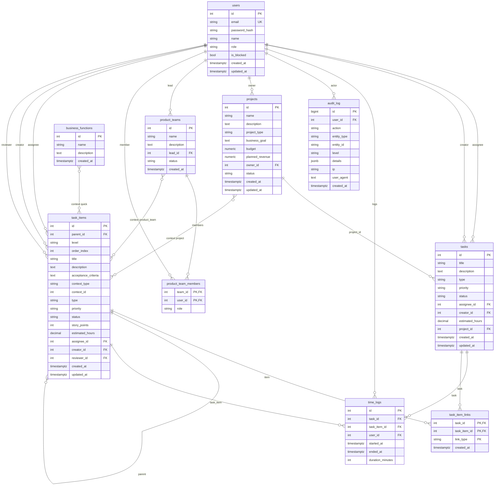

# TaskTime — Current Database / Domain Model Analysis

**Purpose:** Extract and analyze the existing schema for migration and MVP domain design.  
**Date:** March 2025

---

## 1. Entity Diagram (Current Schema)

---

## 2. Entity Summary

| Entity | Purpose | Key relationships |
|--------|---------|-------------------|
| **users** | Accounts, roles, blocking | Referenced by tasks, task_items, projects, teams, time_logs, audit_log |
| **tasks** | Flat “legacy” tasks | project_id, assignee_id, creator_id; linked to task_items via task_item_links |
| **time_logs** | Time tracking | task_id (required), task_item_id (optional), user_id |
| **audit_log** | Audit trail / SIEM | user_id, entity_type, entity_id, details (JSONB) |
| **projects** | Project container | owner_id; task_items use context_type='project', context_id=projects.id |
| **product_teams** | Team container | lead_id; members in product_team_members; task_items context_type='product_team' |
| **product_team_members** | Team membership | team_id, user_id, role |
| **business_functions** | “Quick” context label | task_items context_type='quick', context_id=business_functions.id (polymorphic) |
| **task_items** | Hierarchical work (epic/story/subtask) | parent_id (self), context_type/context_id (project/quick/product_team) |
| **task_item_links** | Link flat task ↔ hierarchical item | task_id, task_item_id, link_type |

---

## 3. Missing Entities (for Jira-like MVP)

| Missing | Impact |
|---------|--------|
| **organizations** | No multi-tenancy; all data is global. Hard to add org-level settings, billing, or isolation later. |
| **comments** | No discussion thread on tasks/issues. Required for collaboration. |
| **sprints** | No sprint entity; cannot assign issues to a time-boxed sprint or show sprint backlog. |
| **boards** | No board entity; “board” is implicit (e.g. project view by status). Cannot have multiple boards per project. |
| **board_columns** | Status is freeform/enum in code; no first-class column definition, order, or WIP limits. |
| **labels** | No labels table; cannot tag issues with multiple labels. |
| **statuses** | Status is string/CHECK in columns; not a shared entity. Different workflows per project/board require new schema. |
| **issue_history** | No change history for issue fields (who changed status when, etc.); only audit_log for high-level actions. |

---

## 4. Risky Schema Decisions

- **Dual task model (tasks + task_items):** Two ways to represent work (flat `tasks` and hierarchical `task_items`) with an optional link. Logic is split (e.g. “create story from task”), and RBAC/APIs must handle both. Unifying into a single “Issue” model would simplify the domain and AI usage.
- **Polymorphic context (task_items):** `context_type` + `context_id` point to project, product_team, or business_functions. No FK to a single table; harder to enforce referential integrity and to query “all items in project” with one join. A single `project_id` (nullable) plus optional `team_id` would be clearer for MVP.
- **tasks.project_id added after projects:** Schema order: tasks created first, then projects, then ALTER tasks ADD project_id. Circular reference risk is avoided by creation order, but migration and init order are fragile.
- **time_logs dual reference:** Can attach to `task_id` and/or `task_item_id`. Ambiguity: which one is “canonical” for a given log? Unifying to one issue entity would remove this.
- **Role in users:** Role is a single string (admin, manager, user, cio, viewer, super-admin). No per-project/per-team roles; scaling to project-level permissions would require a new table (e.g. project_members with role).
- **No soft delete:** DELETE is hard delete. Restore or “archived” state would need new columns or tables.

---

## 5. Normalization Issues

- **Denormalized names in responses:** API often returns `assignee_name`, `creator_name`, `project_name`, `lead_name` via JOINs. Not stored redundantly; acceptable for read path. No materialized aggregates for counts (e.g. “stories per project” are computed on the fly).
- **task_items:** Well normalized; context_type/context_id are polymorphic but not redundant. Order within context is `order_index` on the same table.
- **audit_log.details JSONB:** Flexible but untyped; no schema enforcement. Good for extensibility; bad for strict querying/analytics without conventions.
- **product_team_members.role:** Freeform string (e.g. lead, member). Not normalized to a roles table; acceptable for MVP.

---

## 6. Index Usage (Current)

- **tasks:** assignee_id, creator_id, status, project_id — suitable for list/filter.
- **time_logs:** task_id, user_id — suitable for “logs for task” and “my logs.”
- **audit_log:** created_at, user_id, (entity_type, entity_id), level — suitable for activity and admin views.
- **task_items:** parent_id, (context_type, context_id), assignee_id, status — suitable for tree and context lists.
- **task_item_links:** task_id, task_item_id — suitable for resolving links.

Missing for future scale: composite indexes for “open issues in project by order_index,” “issues in sprint by column,” etc., once sprints/boards exist.

---

## 7. Conclusion

The current schema supports projects, product teams, flat tasks, hierarchical task_items, time logging, and audit. For a Jira-like MVP, the main gaps are: **organizations**, **comments**, **sprints**, **boards/columns**, **labels**, and **issue history**. The **dual task model** and **polymorphic context** are the main architectural risks to address in the MVP domain model and migration (see MVP_DOMAIN_MODEL.md and MIGRATION_PLAN.md).
